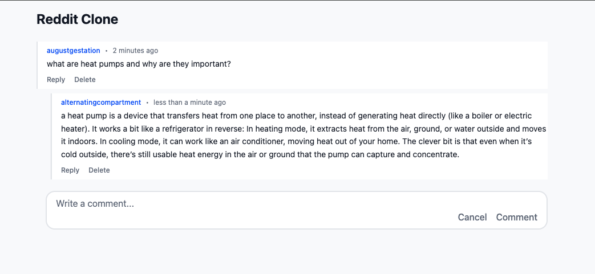

# React Comments Component


A nested comments system built with React, TypeScript, and RxDB for client-side persistence.

## Features

- [x] Display list of comments
- [x] Add new comments with text input
- [x] Delete comments from the list
- [x] Nested comments (reply to comments)
- [x] Persistent comments (survives app restart/refresh)
- [x] Real-time sync across multiple tabs

## Tech Stack

- [x] React
- [x] TypeScript
- [x] Tailwind CSS for styling
- [x] RxDB for database management

## Installation

1. Install dependencies:

```bash
npm install
```

2. Start development server:

```bash
npm run dev
```
